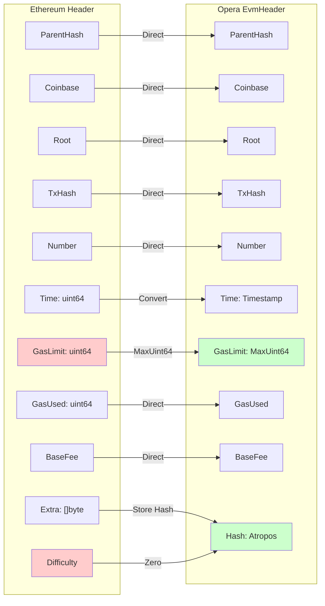
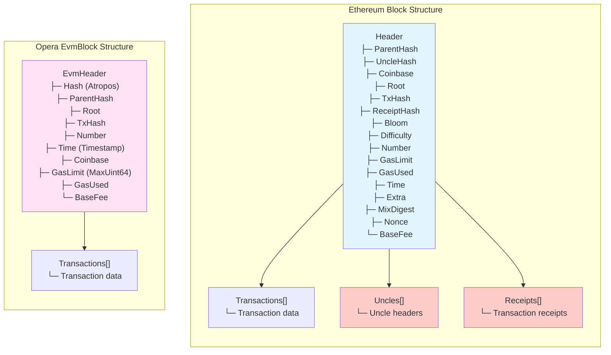
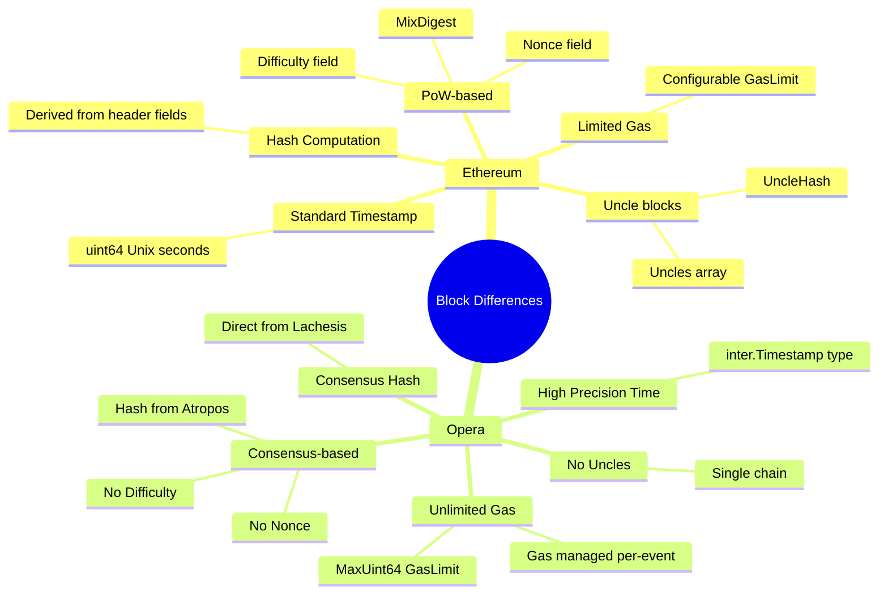
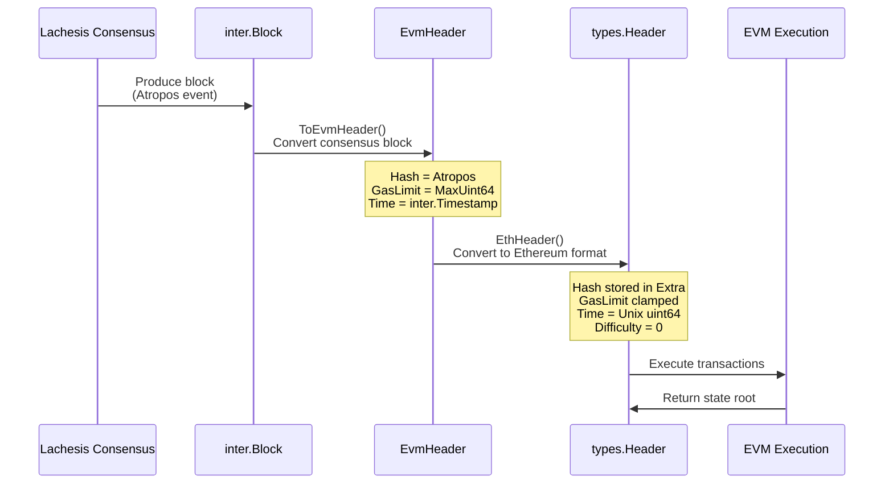
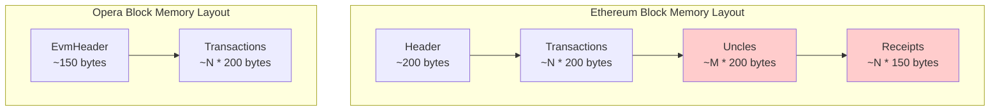

### **Error when setting up a Debugger**

This error is occuring because I have go version 1.24 installed as well as go version 1.20 installed. My project needs go version 1.20. So what I did was to install the debugger that will work with this older go version which is delve version 1.22.1. The issue is that this debugger still points to the latest version of go and it is not compatible. So I had to find a way around it by pointing the settings.json and launch.json to the actual version of go for my current project. This problem will not exist with new projects running the latest version of go as I have tested it and everything works easily. 

Delve is picking up the Go toolchain it finds first on your system `PATH`, which is the newer Go 1.24 you installed globally. To force the debugger to use Go 1.20.14 just for this project, point Cursor/VS Code at the 1.20 toolchain.

1. **Find the Go 1.20.14 install path**

   Run the 1.20 binary directly so you know the correct `GOROOT`:

   ```bash
   /path/to/go1.20.14/bin/go env GOROOT
   ```

   (If you installed via Homebrew, it’ll be something like `/usr/local/opt/go@1.20/libexec`; adjust to whatever the command prints.)

2. **Tell the Go extension to use that toolchain**

   Create or edit `.vscode/settings.json` in the repo:

   ```json
   {
     "go.goroot": "/usr/local/opt/go@1.20/libexec",
     "go.alternateTools": {
       "go": "/usr/local/opt/go@1.20/libexec/bin/go"
     },
     "go.toolsEnvVars": {
       "GOROOT": "/usr/local/opt/go@1.20/libexec",
       "PATH": "/usr/local/opt/go@1.20/libexec/bin:${env:PATH}"
     }
   }
   ```

   Replace the paths with the value you gathered in step 1. `go.alternateTools` makes the Go extension (and Delve) invoke that binary; `go.toolsEnvVars` ensures the right `GOROOT`/`PATH` get exported when the debugger starts.

3. **Update your launch configuration**

   In `.vscode/launch.json`, add the same `env` override to the `Debug opera-asset` entry:

   ```json
   "env": {
     "GOROOT": "/usr/local/opt/go@1.20/libexec",
     "PATH": "/usr/local/opt/go@1.20/libexec/bin:${env:PATH}"
   }
   ```

   Leave `dlvToolPath` pointing at the Delve you already installed (`/Users/ugochukwu/go/bin/dlv`).

4. **Restart the Go extension ( I didn't have to do this, it just worked )** (Command Palette → “Developer: Reload Window”) and re-run the debug session.

With those overrides, Cursor will launch Delve using Go 1.20.14 even though a newer Go is present globally, eliminating the “Delve too old for Go 1.24” error.


## Running Tests

use **go test -v ./test** to run all tests and log everything


**LevelDB** is an embedded key-value database library created by Google. It’s used in blockchain nodes to store chain data.

### What is LevelDB?

- **Embedded database**: Runs in-process (no separate server)
- **Key-value store**: Stores data as key-value pairs
- **Log-structured merge (LSM) tree**: Optimized for write-heavy workloads
- **Persistent**: Data survives process restarts

### Why LevelDB for blockchain nodes?

1. **Write performance**: LSM trees batch writes and flush to disk sequentially, which suits high write throughput.
2. **Ordered iteration**: Keys are stored in sorted order, enabling efficient range queries (e.g., iterate blocks sequentially).
3. **Embedded**: No separate database server to manage; simpler deployment.
4. **Mature**: Widely used in production systems (Bitcoin, Ethereum, etc.).

### How it works

```
Write Operation:
1. Write goes to in-memory "memtable" (fast)
2. When memtable fills, it's flushed to disk as an immutable "SSTable"
3. Multiple SSTables are periodically merged (compaction)
4. Old/deleted data is garbage collected during compaction
```

### Example in blockchain context

```go
// Storing a block:
db.Put([]byte("block:12345"), blockData)  // Fast write to memtable

// Reading a block:
data, _ := db.Get([]byte("block:12345"))    // May check memtable + SSTables

// Iterating blocks in order:
iter := db.NewIterator(nil, nil)
for iter.Next() {
    key := iter.Key()
    value := iter.Value()
    // Process blocks sequentially
}
```

### In your code

`DBPreset: "ldb-1"` means the node uses a LevelDB-based storage layout optimized for write-heavy workloads (e.g., frequent block writes, state updates). The "1" likely refers to a specific configuration variant (cache sizes, compaction settings, etc.).

### Alternatives

- **RocksDB**: Fork of LevelDB with more tuning options
- **BadgerDB**: Go-native LSM tree database
- **PostgreSQL/MySQL**: Relational databases (more overhead, more features)

For blockchain nodes, LevelDB’s write performance and embedded nature make it a common choice.

**SSTable** (Sorted String Table) is an immutable, on-disk data structure used by LevelDB and other LSM-tree databases.

### What is an SSTable?

- **Immutable file**: Once written, it's never modified (only deleted during compaction)
- **Sorted by key**: Keys are stored in sorted order for efficient lookups
- **On-disk storage**: Persists data that was flushed from memory

### How SSTables work in LevelDB

```
1. Writes come in → stored in memory (memtable)
   ┌─────────────────┐
   │   Memtable      │ ← Fast, in-memory, sorted
   │  (in-memory)    │
   └─────────────────┘

2. When memtable fills → flushed to disk as SSTable
   ┌─────────────────┐
   │   SSTable 1     │ ← Immutable, sorted file on disk
   │  (block:1-100)  │
   └─────────────────┘

3. More writes → another SSTable created
   ┌─────────────────┐
   │   SSTable 1     │
   └─────────────────┘
   ┌─────────────────┐
   │   SSTable 2     │ ← New immutable file
   │ (block:101-200) │
   └─────────────────┘

4. Compaction merges SSTables → removes duplicates, keeps sorted order
   ┌─────────────────┐
   │   SSTable 3     │ ← Merged, optimized
   │ (block:1-200)   │
   └─────────────────┘
```

### Why immutable?

- **Simpler concurrency**: No locks needed for reads (file never changes)
- **Crash safety**: If a write fails, existing SSTables remain intact
- **Efficient compaction**: Merging immutable files is straightforward

### Structure of an SSTable file

```
┌─────────────────────────────────────┐
│ Data Block 1 (sorted key-value)   │
├─────────────────────────────────────┤
│ Data Block 2 (sorted key-value)   │
├─────────────────────────────────────┤
│ Index Block (points to data blocks)│
├─────────────────────────────────────┤
│ Footer (metadata, checksums)       │
└─────────────────────────────────────┘
```

### Lookup process

To find a key:
1. Check memtable (most recent writes)
2. If not found, check SSTables from newest to oldest
3. Use index blocks to quickly locate the right data block
4. Return value when found

### Example

```go
// Write operations create SSTables:
db.Put("block:100", data1)  // Goes to memtable
db.Put("block:101", data2)  // Goes to memtable
// ... memtable fills up ...
// → Flushed to disk as SSTable containing block:100-101

// Read operation checks SSTables:
value := db.Get("block:100")  
// 1. Check memtable (not there)
// 2. Check newest SSTable → found! ✓
```

### Benefits

- **Fast writes**: Sequential disk writes (append-only)
- **Efficient reads**: Binary search within sorted files
- **Space efficient**: Compaction removes duplicates and old data
- **Crash resilient**: Immutable files survive crashes

SSTables are the core storage mechanism that makes LevelDB efficient for write-heavy workloads like blockchain nodes.

**PebbleDB** is a Go-native key-value database library written by CockroachDB. It’s inspired by LevelDB/RocksDB but built from scratch in Go.

### What is PebbleDB?

- **Go-native**: Written entirely in Go (no C/C++ dependencies)
- **LSM-tree based**: Similar architecture to LevelDB/RocksDB
- **Embedded**: Runs in-process like LevelDB
- **Production-tested**: Used by CockroachDB

### PebbleDB vs LevelDB

| Feature | LevelDB | PebbleDB |
|---------|---------|----------|
| Language | C++ | Go |
| Performance | Fast writes | Optimized reads + writes |
| Concurrency | Limited | Better concurrent reads |
| Memory management | Manual | Go GC |
| Integration | C bindings needed | Native Go |

### Why "read-heavy analytical workloads"?

1. **Better read concurrency**: Multiple readers can access different SSTables simultaneously without blocking
2. **Optimized iterators**: Efficient range scans for analytical queries
3. **Better caching**: More sophisticated block cache management
4. **Compaction improvements**: Background compaction doesn't block reads as much

### Example use case

```go
// Analytical query: "Get all transactions from block 1000 to 2000"
iter := db.NewIter(&pebble.IterOptions{
    LowerBound: []byte("tx:1000"),
    UpperBound: []byte("tx:2000"),
})
defer iter.Close()

for iter.First(); iter.Valid(); iter.Next() {
    txData := iter.Value()
    // Process transaction for analytics
}
```

### In your code context

```go
DBPreset: "pbl-1"  // PebbleDB layout optimized for read-heavy analytical workloads
```

This suggests:
- **Read-heavy**: Many queries scanning historical data (analytics, reporting)
- **Analytical**: Complex queries (aggregations, range scans, joins)
- **"pbl-1"**: Specific PebbleDB configuration variant (cache sizes, compaction settings)

### When to use PebbleDB vs LevelDB?

- **LevelDB ("ldb-1")**: Write-heavy workloads (validators writing blocks constantly)
- **PebbleDB ("pbl-1")**: Read-heavy workloads (explorers, analytics, reporting tools)

### Real-world analogy

- **LevelDB**: Like a fast cash register (quick writes, simple reads)
- **PebbleDB**: Like a library catalog system (optimized for searching and browsing)

For blockchain nodes doing analytics, reporting, or chain exploration, PebbleDB’s read optimizations make it a good fit.


Diagrams comparing Ethereum and Opera block structures:

## Ethereum Block Structure

```mermaid
graph TB
    subgraph EthereumBlock["Ethereum Block (types.Block)"]
        EthHeader["Block Header<br/>(types.Header)"]
        EthTxs["Transactions<br/>(types.Transactions)"]
        EthUncles["Uncles<br/>([]*Header)"]
        EthReceipts["Receipts<br/>(types.Receipts)"]
        
        EthereumBlock --> EthHeader
        EthereumBlock --> EthTxs
        EthereumBlock --> EthUncles
        EthereumBlock --> EthReceipts
    end
    
    subgraph EthHeaderFields["Ethereum Header Fields"]
        H1["ParentHash: Hash"]
        H2["UncleHash: Hash"]
        H3["Coinbase: Address"]
        H4["Root: Hash (State)"]
        H5["TxHash: Hash"]
        H6["ReceiptHash: Hash"]
        H7["Bloom: Bloom"]
        H8["Difficulty: *big.Int"]
        H9["Number: *big.Int"]
        H10["GasLimit: uint64"]
        H11["GasUsed: uint64"]
        H12["Time: uint64"]
        H13["Extra: []byte"]
        H14["MixDigest: Hash"]
        H15["Nonce: BlockNonce"]
        H16["BaseFee: *big.Int (EIP-1559)"]
        
        EthHeader --> EthHeaderFields
    end
```

## Opera EVM-Compatible Block Structure

```mermaid
graph TB
    subgraph OperaBlock["Opera EvmBlock"]
        OperaHeader["EvmHeader"]
        OperaTxs["Transactions<br/>(types.Transactions)"]
        
        OperaBlock --> OperaHeader
        OperaBlock --> OperaTxs
    end
    
    subgraph OperaHeaderFields["Opera EvmHeader Fields"]
        O1["Hash: Hash<br/>(from Atropos)"]
        O2["ParentHash: Hash"]
        O3["Root: Hash (State)"]
        O4["TxHash: Hash"]
        O5["Number: *big.Int"]
        O6["Time: inter.Timestamp"]
        O7["Coinbase: Address"]
        O8["GasLimit: uint64<br/>(MaxUint64)"]
        O9["GasUsed: uint64"]
        O10["BaseFee: *big.Int<br/>(if London)"]
        
        OperaHeader --> OperaHeaderFields
    end
```

## Field Mapping: Ethereum ↔ Opera



## Detailed Comparison Table

| Field | Ethereum (types.Header) | Opera (EvmHeader) | Notes |
|-------|------------------------|-------------------|-------|
| **ParentHash** | common.Hash | common.Hash | Direct mapping |
| **Hash** | Computed from fields | common.Hash (from Atropos) | Opera uses consensus hash |
| **Root** | common.Hash (State) | common.Hash (State) | Direct mapping |
| **TxHash** | common.Hash | common.Hash | Direct mapping |
| **Number** | *big.Int | *big.Int | Direct mapping |
| **Time** | uint64 (Unix seconds) | inter.Timestamp | Opera has higher precision |
| **Coinbase** | common.Address | common.Address | Direct mapping |
| **GasLimit** | uint64 (configurable) | uint64 (MaxUint64) | Opera unlimited |
| **GasUsed** | uint64 | uint64 | Direct mapping |
| **BaseFee** | *big.Int (EIP-1559) | *big.Int (if London) | Direct mapping |
| **Difficulty** | *big.Int (PoW) | N/A | Opera doesn't use PoW |
| **UncleHash** | common.Hash | N/A | Opera has no uncles |
| **ReceiptHash** | common.Hash | N/A | Computed separately |
| **Bloom** | types.Bloom | N/A | Computed separately |
| **Extra** | []byte | Used to store Hash | Hack for compatibility |

## Visual Block Structure Comparison



## Key Differences Summary



## Conversion Flow Diagram



## Memory Layout Comparison



## Takeaways

1. Opera blocks are simpler: no uncles, no receipts in block structure, no PoW fields.
2. GasLimit is always MaxUint64 in Opera (gas managed per-event, not per-block).
3. Hash comes from consensus (Atropos), not computed from header fields.
4. Time uses higher precision (inter.Timestamp vs uint64).
5. Conversion is bidirectional: Opera ↔ Ethereum for EVM compatibility.

These diagrams show how Opera's consensus blocks map to Ethereum's format for EVM execution while keeping Opera-specific fields.

Checking the context of `RulesRLP` in the code:


[2 tools called]


RLP stands for Recursive Length Prefix. It's Ethereum's serialization format.

## What is RLP?

RLP is Ethereum's binary encoding format used to:
- Serialize data structures (transactions, blocks, state)
- Store data in the blockchain
- Transmit data over the network
- Compute hashes and signatures

## Why "RulesRLP"?

Looking at line 55-57 in your code:

```go
// RulesRLP is the RLP-serializable version of Rules.
// It contains all network configuration parameters that need to be persisted
// or transmitted over the network.
```

`RulesRLP` is a version of `Rules` that can be RLP-encoded/decoded for:
- Persistence (saving to disk/database)
- Network transmission (sending between nodes)
- Hashing (computing deterministic hashes)

## Key Features of RLP

1. Deterministic: Same input always produces the same output
2. Compact: Efficient binary encoding
3. Self-describing: Includes length information
4. Recursive: Can encode nested structures

## Example in Your Code

```go
type RulesRLP struct {
    Name      string
    NetworkID uint64
    Dag       DagRules
    // ...
    Upgrades Upgrades `rlp:"-"`  // Excluded from RLP encoding
}
```

The `rlp:"-"` tag on line 75 excludes the `Upgrades` field from RLP encoding, meaning it won't be serialized when encoding `RulesRLP`.

## Why Not Just Use JSON?

- Deterministic: RLP always produces the same bytes (JSON can vary)
- Compact: More efficient than JSON
- Standard: Ethereum's native format
- Hash-friendly: Designed for cryptographic hashing

## Common Use Cases

- Transaction encoding (RLP-encoded transactions)
- Block headers (RLP-encoded block data)
- State trie keys/values
- Network protocol messages

In summary, RLP is Ethereum's binary serialization format, and `RulesRLP` is the RLP-serializable version of your `Rules` struct for persistence and network transmission.